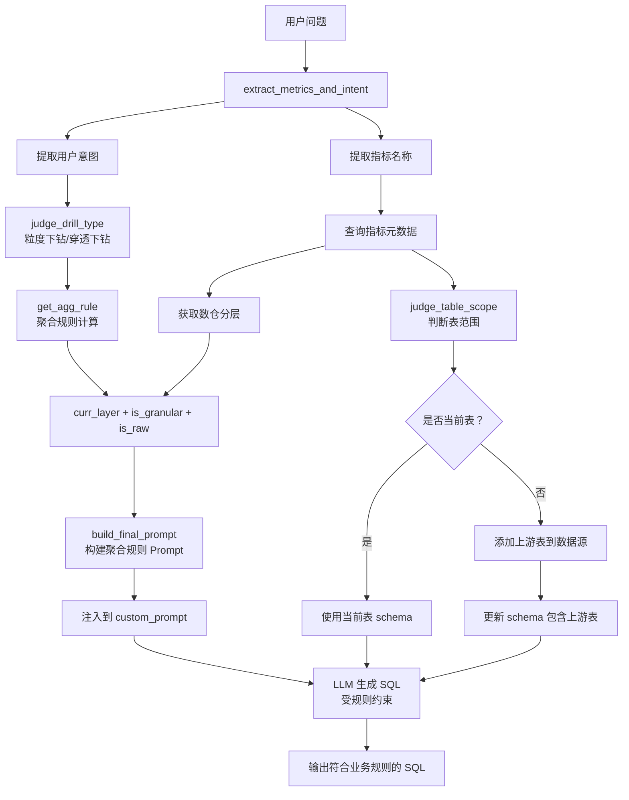

# 指标下钻分析器集成方案（含规则引擎）

## 📋 需求背景

### 原有问题
1. **意图识别不准确**：仅提取指标名称，无法判断用户是要"汇总"还是"查明细"
2. **SQL 生成不符合业务规则**：LLM 可能违反数仓分层规则（如在 DWS 层不加聚合函数）
3. **表范围判断缺失**：无法自动判断用户要查当前表还是上游明细表

### 解决方案
整合 `drill_agg_rule_engine.py` 规则引擎，实现：
- ✅ 同时提取指标名称 + 用户意图
- ✅ 基于规则引擎严格限制 SQL 生成
- ✅ 智能判断表范围并添加到数据源
- ✅ 动态注入聚合规则到 LLM Prompt

---

## 🏗️ 核心架构

### 整体流程



---

## 🔧 核心组件

### 1. `DrillAggRuleEngine` - 聚合规则引擎

**位置**: `backend/apps/extend/drilldown/drill_agg_rule_engine.py`

**核心方法**:

```python
class DrillAggRuleEngine:
    def __init__(self):
        # 从配置文件加载关键词
        self.granular_drill_keywords = [...]  # 粒度下钻关键词
        self.drill_keywords = [...]           # 通用下钻关键词
        self.aggregate_keywords = [...]       # 聚合关键词
        self.detail_raw_keywords = [...]      # 明细关键词
    
    def judge_drill_type(self, question) -> Tuple[bool, bool]:
        """
        判断下钻类型
        返回：(is_granular, is_raw)
        - (True, False): 粒度下钻
        - (False, True): 穿透下钻（查明细）
        - (False, False): 不下钻
        """
        
    def get_agg_rule(self, question, curr_layer, is_granular, is_raw) -> Tuple[str, bool]:
        """
        计算聚合规则
        返回：(rule_desc, need_agg)
        - rule_desc: 规则描述（如"不聚合，查原始明细"）
        - need_agg: 是否需要聚合函数
        """
        
    def build_final_prompt(self, question, curr_layer) -> str:
        """
        构建最终 Prompt（包含硬编码规则 + 动态指令）
        """
```

**优先级顺序**:
1. **最高优先级**：关键词判断（"明细" > "汇总"）
2. **次优先级**：下钻类型判断（`is_granular` / `is_raw`）
3. **兜底优先级**：数仓分层判断（DWS/ADS 强制聚合，DWD/ODS 禁止聚合）

---

### 2. `MetricDrilldownHandler` - 指标下钻分析器（增强版）

**位置**: `backend/apps/extend/drilldown/metric_drilldown_handler.py`

**新增方法**:

#### 2.1 `extract_metrics_and_intent()` - 提取指标和意图

```python
def extract_metrics_and_intent(self, llm_client, question: str) -> Tuple[List[str], Dict[str, Any]]:
    """
    从用户问题中同时提取指标名称和用户意图
    
    Returns:
        metrics: List[str] - 指标名称列表
        chat_manager: Dict[str, Any] - 用户意图字典
            {
                "is_granular": bool,      # 是否粒度下钻
                "is_raw": bool,           # 是否穿透下钻
                "need_agg": bool,         # 是否需要聚合
                "agg_rule_desc": str,     # 聚合规则描述
                "reason": str             # 判断理由
            }
    """
```

**实现细节**:
1. **步骤 1**：LLM 初步提取指标和意图
2. **步骤 2**：使用 `rule_engine.judge_drill_type()` 二次判断（更可靠）
3. **步骤 3**：根据规则引擎结果修正 `need_agg`
4. **降级方案**：LLM 失败时使用规则引擎兜底

**示例**:
```python
# 输入
question = "按月下钻指标 d7_sum 的明细数据"

# 输出
metrics = ["d7_sum"]
intent = {
    "is_granular": True,   # 包含"下钻"
    "is_raw": True,        # 包含"明细"
    "need_agg": False,     # "明细"优先级更高
    "agg_rule_desc": "不聚合，查原始明细",
    "reason": "包含'明细'关键词，触发穿透下钻"
}
```

---

#### 2.2 `judge_table_scope()` - 判断表范围

```python
def judge_table_scope(self, llm_client, question: str, metric_info_list: List) -> Dict[str, Any]:
    """
    判断用户要查询的表范围（当前表还是上游表）
    
    Returns:
        {
            "is_current_table": bool,      # 是否查询当前表
            "target_tables": List[str],    # 目标表名列表
            "reason": str                  # 判断理由
        }
    """
```

**实现细节**:
1. 从 MD 文档中提取字段血缘关系
2. 构建血缘描述："d7_sum ← feed_count (SUM) [源表：dwd_feed_detail]"
3. LLM 根据血缘和意图判断表范围

**判断规则**:
- **查询当前表**：包含"汇总"、"统计"、"本月"等词
- **查询上游表**：包含"明细"、"原始数据"、"为什么是这个数"等词

**示例**:
```python
# 输入
question = "查看 d7_sum 的原始明细"
metric_info_list = [MetricInfo(table_name="ads_algo_female_batch_production")]

# 输出
{
    "is_current_table": False,
    "target_tables": ["dwd_feed_detail", "ods_user_behavior"],
    "reason": "用户要求查明细，需查询上游源表"
}
```

---

### 3. `LLMService.generate_answer_with_llm()` - LLM 服务集成

**位置**: `backend/apps/chat/task/llm.py`

**修改点**:

#### 3.1 提取指标和意图（第 1169-1170 行）

```python
# 原代码（只提取指标）
metrics = self.metric_drilldown.get_metric_from_question(self.llm, self.chat_question.question)

# 新代码（同时提取意图）
metrics, user_intent = self.metric_drilldown.extract_metrics_and_intent(
    self.llm, 
    self.chat_question.question
)
SQLBotLogUtil.info(f"提取的指标：{metrics}, 用户意图：{user_intent}")
```

---

#### 3.2 应用聚合规则到 Prompt（第 1196-1213 行）

```python
if metric_info_list and len(metric_info_list) > 0:
    # 获取数仓分层
    curr_layer = metric_info_list[0].dw_layer or "unknown"
    
    # 构建聚合规则提示词
    agg_rule_prompt = self.metric_drilldown.rule_engine.build_final_prompt(
        question=self.chat_question.question,
        curr_layer=curr_layer
    )
    
    # 注入到 custom_prompt
    if not self.chat_question.custom_prompt:
        self.chat_question.custom_prompt = agg_rule_prompt
    else:
        self.chat_question.custom_prompt += f"\n\n{agg_rule_prompt}"
    
    SQLBotLogUtil.info(f"已注入聚合规则到 Prompt: {agg_rule_prompt}")
```

**注入效果示例**:
```python
# 假设用户问题："查询 d7_sum 的明细数据"
# 数仓分层：ADS

# 最终注入的 custom_prompt
"""
【系统强制聚合规则（不可违反）】
1. 汇总层 (ADS/DWS) 必须使用聚合函数+GROUP BY；
2. 明细层 (DWD/ODS) 禁止任何聚合函数；
3. 严格按指令生成 SQL，禁止自主推断；
4. 规则冲突时，优先执行【不聚合】策略。

【当前指令】不聚合，查原始明细，分层：ADS
"""
```

---

#### 3.3 判断表范围并添加到数据源（第 1215-1235 行）

```python
# 判断表范围
table_scope = self.metric_drilldown.judge_table_scope(
    self.llm, 
    self.chat_question.question, 
    metric_info_list
)
SQLBotLogUtil.info(f"表范围判断结果：{table_scope}")

# 如果需要查询上游表
if not table_scope['is_current_table'] and table_scope['target_tables']:
    existing_tables = set(table_name_list)
    upstream_tables = [t for t in table_scope['target_tables'] if t not in existing_tables]
    
    if upstream_tables:
        SQLBotLogUtil.info(f"需要添加上游表到数据源：{upstream_tables}")
        self._batch_add_tables_to_ds(_session, upstream_tables)
        
        # 重新获取 schema（包含上游表）
        all_tables = list(set(table_name_list + upstream_tables))
        table_scheme = get_table_schema(
            session=_session,
            current_user=self.current_user, 
            ds=self.ds,
            question=self.chat_question.question,
            table_name_list=all_tables
        )
        self.chat_question.db_schema = table_scheme
        self.refresh_sql_messages_with_new_schema()
        SQLBotLogUtil.info(f"已更新 schema，包含上游表：{all_tables}")
```

---

## 🎯 完整执行流程

### 场景 1：查询汇总表（常规下钻）

**用户问题**: "按月下钻指标 d7_sum"

**执行流程**:
```
1. extract_metrics_and_intent()
   ├─ 提取指标：["d7_sum"]
   └─ 判断意图：
      ├─ is_granular = True (包含"下钻")
      ├─ is_raw = False
      └─ need_agg = True (需要按维度拆分并聚合)

2. get_metric_metadata_by_names()
   └─ 获取元数据：[MetricInfo(table_name="ads_algo_female_batch_production", dw_layer="ADS")]

3. build_final_prompt()
   ├─ curr_layer = "ADS"
   ├─ is_granular = True
   └─ 输出规则："聚合，按维度拆分"
   
4. 注入到 custom_prompt:
   """
   【系统强制聚合规则】
   1. 汇总层 (ADS/DWS) 必须使用聚合函数+GROUP BY
   ...
   
   【当前指令】聚合，按维度拆分，分层：ADS
   """

5. judge_table_scope()
   ├─ 判断：用户要查询汇总数据
   └─ 输出：is_current_table=True, target_tables=["ads_algo_female_batch_production"]

6. LLM 生成 SQL（受规则约束）:
   ```sql
   SELECT 
      dt_month,
      SUM(d7_sum) AS total_d7
   FROM ads_algo_female_batch_production
   GROUP BY dt_month
   ```
```

---

### 场景 2：查询明细数据（穿透下钻）

**用户问题**: "查看 d7_sum 的明细数据"

**执行流程**:
```
1. extract_metrics_and_intent()
   ├─ 提取指标：["d7_sum"]
   └─ 判断意图：
      ├─ is_granular = False
      ├─ is_raw = True (包含"明细")
      └─ need_agg = False (不聚合)

2. get_metric_metadata_by_names()
   └─ 获取元数据：[MetricInfo(table_name="ads_algo_female_batch_production", dw_layer="ADS")]

3. build_final_prompt()
   ├─ curr_layer = "ADS"
   ├─ is_raw = True
   └─ 输出规则："不聚合，查原始明细"
   
4. 注入到 custom_prompt:
   """
   【系统强制聚合规则】
   ...
   4. 规则冲突时，优先执行【不聚合】策略。  ← 这条生效！
   
   【当前指令】不聚合，查原始明细，分层：ADS
   """

5. judge_table_scope()
   ├─ 判断：用户要查明细
   ├─ 解析 MD 血缘：
   │   d7_sum ← feed_count (SUM) [源表：dwd_feed_detail]
   │   d7_sum ← user_id (直接映射) [源表：ods_user_behavior]
   └─ 输出：
      is_current_table=False,
      target_tables=["dwd_feed_detail", "ods_user_behavior"]

6. 添加上游表到数据源:
   ├─ _batch_add_tables_to_ds(["dwd_feed_detail", "ods_user_behavior"])
   └─ 更新 schema 包含这 2 张表

7. LLM 生成 SQL（受规则约束）:
   ```sql
   SELECT 
      d.feed_count,
      u.user_id,
      d.dt_date
   FROM dwd_feed_detail d
   JOIN ods_user_behavior u ON d.user_id = u.user_id
   WHERE d.dt_month = '2024-01'
   ORDER BY d.dt_date
   -- ❌ 不使用聚合函数（遵守"不聚合"规则）
   ```
```

---

### 场景 3：混合场景（先汇总后明细）

**用户问题**: "先汇总本月 d7_sum，再查看具体明细"

**执行流程**:
```
1. extract_metrics_and_intent()
   ├─ 提取指标：["d7_sum"]
   └─ 判断意图：
      ├─ is_granular = False
      ├─ is_raw = True (包含"明细"，优先级高)
      └─ need_agg = False

2. build_final_prompt()
   └─ 输出规则："不聚合，查原始明细"

3. judge_table_scope()
   ├─ 分析：虽然提到"汇总"，但后面要求"查看具体明细"
   └─ 输出：is_current_table=False (查明细)

4. LLM 生成 SQL:
   ```sql
   -- 查明细（遵守"明细"优先级）
   SELECT 
      d.*,
      u.*
   FROM dwd_feed_detail d
   JOIN ods_user_behavior u ON d.user_id = u.user_id
   WHERE d.dt_month = '2024-01'
   ```
   
   💡 如果用户想看汇总，应该问："汇总本月 d7_sum"（没有"明细"关键词）
```

---

## 🧪 测试验证

### 运行测试脚本

```bash
cd backend
python apps/extend/drilldown/test_drilldown_integration.py
```

### 预期输出

```
================================================================================
指标下钻分析器集成测试（含规则引擎）
================================================================================

============================================================
测试场景 1：提取指标名称和用户意图
============================================================

【测试用例 1】按月下钻指标 d7_sum
------------------------------------------------------------
提取的指标：['d7_sum']
用户意图：{'is_granular': True, 'is_raw': False, 'need_agg': True, ...}
预期指标：['d7_sum']
✅ 指标提取正确
✅ 意图判断正确

【测试用例 2】查询 d7_sum 的明细数据
------------------------------------------------------------
提取的指标：['d7_sum']
用户意图：{'is_granular': False, 'is_raw': True, 'need_agg': False, ...}
预期指标：['d7_sum']
✅ 指标提取正确
✅ 意图判断正确

============================================================
测试场景 2：判断表范围（当前表/上游表）
============================================================

【测试用例 1】查询 d7_sum 的汇总数据
------------------------------------------------------------
是否当前表：True
目标表：['ads_algo_female_batch_production']
判断理由：用户要求查询汇总数据，应使用当前指标表
✅ 表范围判断正确

【测试用例 2】查看 d7_sum 的原始明细
------------------------------------------------------------
是否当前表：False
目标表：['dwd_feed_detail', 'ods_user_behavior']
判断理由：用户要求查明细，需查询上游源表
✅ 表范围判断正确

================================================================================
✅ 所有测试完成！
================================================================================
```

---

## 📊 性能优化

### 1. 批量添加表到数据源

```python
# ❌ 错误做法：逐个添加（多次触发 embedding）
for table in upstream_tables:
    self.static_sql_handler.add_table_to_ds(self.ds, table)

# ✅ 正确做法：批量添加（一次触发 embedding）
self._batch_add_tables_to_ds(_session, upstream_tables)
```

**优势**:
- 减少数据库 INSERT 操作
- 避免重复的向量相似度匹配
- 降低 Embedding API 调用次数

---

### 2. Set 去重

```python
# 使用 set 去重
existing_tables = set(table_name_list)
upstream_tables = [t for t in table_scope['target_tables'] if t not in existing_tables]
all_tables = list(set(table_name_list + upstream_tables))
```

**优势**:
- 避免重复添加相同的表
- 减少不必要的 schema 查询

---

## 🎯 关键优势

### 对比原有方案

| 功能点 | 原有方案 | 新方案（整合规则引擎） |
|--------|----------|----------------------|
| **意图识别** | 仅提取指标名称 | 同时提取指标 + 意图（下钻类型/聚合规则） |
| **SQL 准确性** | LLM 自由发挥，可能违反规则 | 严格受规则约束，符合业务逻辑 |
| **表范围判断** | 无，只能查当前表 | 智能判断当前表/上游表 |
| **数仓分层** | 无感知 | 自动识别 ADS/DWS/DWD/ODS 层 |
| **优先级处理** | 无 | "明细"优先级 > "汇总"优先级 |
| **降级方案** | 无 | LLM 失败时使用规则引擎兜底 |

---

## 🔍 调试技巧

### 1. 查看日志输出

```python
# 关键日志点
SQLBotLogUtil.info(f"提取的指标：{metrics}, 用户意图：{user_intent}")
SQLBotLogUtil.info(f"表范围判断结果：{table_scope}")
SQLBotLogUtil.info(f"已注入聚合规则到 Prompt: {agg_rule_prompt}")
```

### 2. 检查 custom_prompt

在 `generate_sql()` 调用前打印：
```python
print(f"Final custom_prompt: {self.chat_question.custom_prompt}")
```

### 3. 验证生成的 SQL

检查是否符合规则：
- ✅ "明细" → 无聚合函数
- ✅ "汇总" + DWS 层 → 有聚合函数 + GROUP BY
- ✅ 上游表查询 → FROM 子句包含上游表名

---

## 📝 总结

### 核心价值

1. **精准意图识别**：不再混淆"汇总"和"明细"
2. **规则硬约束**：LLM 无法违反数仓分层规则
3. **智能表范围判断**：自动识别是否需要查上游表
4. **端到端自动化**：从问题到 SQL 全流程无需人工干预

### 后续优化方向

1. **多指标合并**：当多个指标来自不同表时，自动 JOIN
2. **血缘缓存**：避免重复解析 MD 文档
3. **规则自学习**：根据用户反馈优化关键词库
4. **性能监控**：统计规则命中率和 SQL 准确率

---

## 📚 相关文件

- `backend/apps/extend/drilldown/drill_agg_rule_engine.py` - 聚合规则引擎
- `backend/apps/extend/drilldown/metric_drilldown_handler.py` - 指标下钻分析器
- `backend/apps/extend/drilldown/test_drilldown_integration.py` - 集成测试脚本
- `backend/apps/chat/task/llm.py` - LLM 服务（集成点）
- `backend/apps/extend/format/parse_md_to_json.py` - MD 文档解析器
