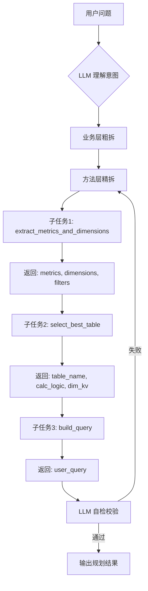
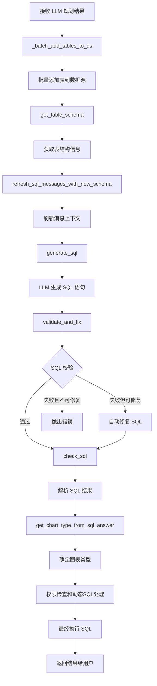

# SQLBot Function Calling 完整架构设计

## 📊 核心设计理念

**分层架构**：将系统分为 **LLM 规划层** 和 **系统执行层**，明确职责边界。

```
┌─────────────────────────────────────────────────┐
│           LLM 规划层（Function Calling）          │
│  负责：决策调用哪些方法、顺序、参数               │
│  工具：extract → select → build                 │
└─────────────────────────────────────────────────┘
                      ↓ 传递规划结果
┌─────────────────────────────────────────────────┐
│           系统执行层（自动执行）                   │
│  负责：具体实现、数据操作、校验、执行             │
│  方法：search_metrics, get_schema, generate_sql  │
└─────────────────────────────────────────────────┘
```

---

## 🔄 完整执行流程图

### 阶段1：LLM 规划层（用户可见）



### 阶段2：系统执行层（对用户透明）



### 完整流程（合并视图）

```
用户问题
  ↓
═══════════════════════════════════════════
  LLM 规划层（Function Calling）
═══════════════════════════════════════════
  ├─ Step 1: extract_metrics_and_dimensions
  │   └─ 输入: question, chat_id
  │   └─ 输出: {metrics, dimensions, filters}
  │
  ├─ Step 2: select_best_table
  │   └─ 输入: metric_code, dimensions
  │   └─ 输出: {table_name, calc_logic, dim_kv}
  │   └─ 内部自动执行:
  │       ├─ search_metrics (查询指标元数据)
  │       ├─ search_columns (检查当前表维度)
  │       └─ search_columns (检查上游表维度)
  │
  └─ Step 3: build_query
      └─ 输入: dimensions, dim_kv, date_filter, metric_name, calc_logic
      └─ 输出: {user_query}
  ↓
═══════════════════════════════════════════
  系统执行层（自动执行，LLM 不关心）
═══════════════════════════════════════════
  ├─ Step 4: _batch_add_tables_to_ds
  │   └─ 批量添加表到数据源（避免重复 embedding）
  │
  ├─ Step 5: get_table_schema
  │   └─ 获取表结构信息（用于 SQL 生成）
  │
  ├─ Step 6: refresh_sql_messages_with_new_schema
  │   └─ 刷新消息上下文（保持对话连贯性）
  │
  ├─ Step 7: generate_sql
  │   └─ LLM 根据 user_query + db_schema 生成 SQL
  │
  ├─ Step 8: validate_and_fix
  │   └─ SQL 校验引擎（检查 ADS/DWS 层规范）
  │   └─ 自动修复（如可能）
  │
  ├─ Step 9: check_sql
  │   └─ 解析 SQL 结果，提取表名列表
  │
  ├─ Step 10: get_chart_type_from_sql_answer
  │   └─ 根据 SQL 确定图表类型（柱状图、折线图等）
  │
  └─ Step 11: 权限检查和动态SQL处理
      └─ 行级权限过滤
      └─ 动态数据源处理
      └─ 最终执行 SQL
  ↓
返回结果给用户
```

---

## 🎯 关键设计原则

### 1. **方法池唯一性**

LLM 只能使用【可用方法清单】中的 3 个方法：
- `extract_metrics_and_dimensions`
- `select_best_table`
- `build_query`

**禁止**：
- ❌ 创造新方法
- ❌ 跳过某个方法
- ❌ 合并多个方法

### 2. **1任务 = 1方法**

每个子任务必须且只能绑定 1 个方法：

```python
# ✅ 正确：每个子任务绑定1个方法
子任务1 → extract_metrics_and_dimensions
子任务2 → select_best_table
子任务3 → build_query

# ❌ 错误：一个子任务绑定多个方法
子任务1 → extract_metrics_and_dimensions + select_best_table
```

### 3. **方法是黑盒**

LLM 只需知道方法的**输入**和**输出**，**不需要关心内部实现**。

**示例：`select_best_table` 的内部实现**

```python
def select_best_table(metric_source_mapping, column_metadata_service, metric_code, dimensions):
    # === 这些内部步骤对 LLM 是黑盒 ===
    
    # 步骤1：查询指标元数据
    metric_info_list = metric_source_mapping.search_metrics([metric_code])
    
    # 步骤2：尝试当前表
    results = column_metadata_service.search_columns(...)
    if results['found']:
        return {...}
    
    # 步骤3：尝试上游表
    if metric.upstream_table:
        results = column_metadata_service.search_columns(...)
        if results['found']:
            return {...}
    
    # 步骤4：抛出错误
    raise ValueError(...)
```

**LLM 看到的只是：**
- 输入：`metric_code`, `dimensions`
- 输出：`{table_name, calc_logic, dim_kv}`
- **内部如何实现，LLM 完全不知道，也不需要知道**

### 4. **严格顺序执行**

方法调用顺序由**数据依赖**决定，不能颠倒：

```
extract_metrics_and_dimensions  ← 必须先执行，提供 metrics/dimensions
    ↓
select_best_table               ← 依赖上一步的 metrics/dimensions
    ↓
build_query                     ← 依赖上两步的所有输出
```

**禁止并行调用**，必须串行等待上一个方法返回结果。

### 5. **自检机制**

LLM 在输出前必须自查 5 点：

1. ✅ 是否按顺序调用了 3 个方法？
2. ✅ 每个子任务是否只绑定了 1 个方法？
3. ✅ 是否有跳过或合并方法的情况？
4. ✅ 是否尝试拆分方法内部逻辑？
5. ✅ 每个方法的参数是否完整且来源正确？

**任何一项不满足，必须重新拆解。**

---

## 📋 方法详细清单

### LLM 规划层方法（暴露给 LLM）

#### 1. extract_metrics_and_dimensions

| 属性 | 值 |
|------|-----|
| **功能** | 从自然语言问题中提取指标、维度和过滤条件 |
| **输入** | `question` (string), `chat_id` (string) |
| **输出** | `{metrics: [str], dimensions: [str], filters: [str]}` |
| **适用场景** | 任何用户提出数据查询问题时，必须首先调用 |
| **边界** | 只负责提取，不负责验证或查询数据 |

**内部实现（对 LLM 黑盒）：**
```python
result = chat_service.extract_metric_and_dim_from_question(
    session=session,
    question=question,
    chat_id=chat_id
)
# 校验 metrics 和 dimensions 是否为空
return result
```

---

#### 2. select_best_table

| 属性 | 值 |
|------|-----|
| **功能** | 根据指标和维度选择最合适的物理表 |
| **输入** | `metric_code` (string), `dimensions` (list) |
| **输出** | `{table_name: str, calc_logic: str, dim_kv: [str]}` |
| **适用场景** | 提取到指标和维度后，必须调用此方法找到数据来源 |
| **边界** | 自动处理表选择逻辑（当前表→上游表），LLM 无需关心内部实现 |

**内部实现（对 LLM 黑盒）：**
```python
# 步骤1：查询指标元数据
metric_info_list = metric_source_mapping.search_metrics([metric_code])

# 步骤2：尝试当前表（ADS/DWS层）
results = column_metadata_service.search_columns({
    "table_name": metric.db_table,
    "column_comments": dimensions
})
if results['found']:
    return {
        'table_name': metric.db_table,
        'calc_logic': metric.agg_func,  # 聚合函数
        'dim_kv': [...]
    }

# 步骤3：尝试上游表（DWD/ODS层）
if metric.upstream_table:
    results = column_metadata_service.search_columns({
        "table_name": metric.upstream_table,
        "column_comments": dimensions
    })
    if results['found']:
        return {
            'table_name': metric.upstream_table,
            'calc_logic': metric.calc_logic,  # 完整SQL表达式
            'dim_kv': [...]
        }

# 步骤4：抛出错误
raise ValueError("维度无法继续下钻...")
```

---

#### 3. build_query

| 属性 | 值 |
|------|-----|
| **功能** | 构建最终的查询语句 |
| **输入** | `dimensions`, `dim_kv`, `date_filter`, `metric_name`, `calc_logic` |
| **输出** | `{user_query: str}` |
| **适用场景** | 获取到表信息和字段映射后，必须调用此方法生成最终查询 |
| **边界** | 只负责格式化输出，不执行 SQL |

**内部实现（对 LLM 黑盒）：**
```python
user_query = (
    f"按{','.join(dimensions)}分组，"
    f"分组参考字段：{','.join(dim_kv)}，"
    f"查询{'和'.join(date_filter)}的{metric_name}，"
    f"{metric_name}计算逻辑为{calc_logic}"
)
return {'user_query': user_query}
```

---

### 系统执行层方法（对 LLM 黑盒）

| 方法名 | 功能 | 调用时机 | LLM 是否需要知道 |
|--------|------|----------|-----------------|
| `_batch_add_tables_to_ds` | 批量添加表到数据源 | Step 4 | ❌ 不需要 |
| `get_table_schema` | 获取表结构信息 | Step 5 | ❌ 不需要 |
| `refresh_sql_messages_with_new_schema` | 刷新消息上下文 | Step 6 | ❌ 不需要 |
| `generate_sql` | LLM 生成 SQL | Step 7 | ⚠️ 可选（作为独立 Function） |
| `validate_and_fix` | SQL 校验和修复 | Step 8 | ❌ 不需要 |
| `check_sql` | 解析 SQL 结果 | Step 9 | ❌ 不需要 |
| `get_chart_type_from_sql_answer` | 确定图表类型 | Step 10 | ❌ 不需要 |
| 权限检查和动态SQL处理 | 行级权限过滤等 | Step 11 | ❌ 不需要 |

---

## 🔧 集成示例

### llm.py 中的完整集成代码

```python
from apps.extend.tools import ToolRegistry

class LLMTask:
    def process_query(self, _session):
        """
        完整的数据查询处理流程
        
        分为两个阶段：
        1. LLM 规划层：调用 3 个工具方法
        2. 系统执行层：自动执行后续步骤
        """
        
        # ═══════════════════════════════════════
        # 阶段1：LLM 规划层（Function Calling）
        # ═══════════════════════════════════════
        
        # Step 1: 提取指标和维度
        extraction_result = ToolRegistry.call_tool(
            "extract_metrics_and_dimensions",
            session=_session,
            chat_service=self.chat_service,
            question=self.chat_question.question,
            chat_id=self.chat_question.chat_id
        )
        
        # Step 2: 选择最佳表
        table_result = ToolRegistry.call_tool(
            "select_best_table",
            metric_source_mapping=self.metric_source_mapping,
            column_metadata_service=self.column_metadata_service,
            metric_code=extraction_result['metrics'][0],
            dimensions=extraction_result['dimensions']
        )
        
        # Step 3: 构建查询语句
        query_result = ToolRegistry.call_tool(
            "build_query",
            dimensions=extraction_result['dimensions'],
            dim_kv=table_result['dim_kv'],
            date_filter=extraction_result['filters'],
            metric_name=self._get_metric_name(extraction_result['metrics'][0]),
            calc_logic=table_result['calc_logic']
        )
        
        # ═══════════════════════════════════════
        # 阶段2：系统执行层（自动执行）
        # ═══════════════════════════════════════
        
        # Step 4: 批量添加表到数据源
        self._batch_add_tables_to_ds(_session, [table_result['table_name']])
        
        # Step 5: 获取表结构
        table_schemes = get_table_schema(
            session=_session,
            current_user=self.current_user,
            ds=self.ds,
            question=query_result['user_query'],
            table_name_list=[table_result['table_name']]
        )
        self.chat_question.db_schema = table_schemes
        
        # Step 6: 更新用户问题并刷新消息
        self.chat_question.question = query_result['user_query']
        self.refresh_sql_messages_with_new_schema()
        
        # Step 7: LLM 生成 SQL
        sql_res = self.generate_sql(_session)
        full_sql_text = ''.join([chunk.get('content') for chunk in sql_res])
        
        # Step 8: SQL 校验和修复
        is_valid, fixed_sql_json, error_msg = self.sql_validator.validate_and_fix(full_sql_text)
        if not is_valid:
            raise ValueError(error_msg)
        if fixed_sql_json:
            full_sql_text = fixed_sql_json
        
        # Step 9: 解析 SQL 结果
        sql, table_name_list = self.check_sql(res=full_sql_text)
        
        # Step 10: 确定图表类型
        chart_type = self.get_chart_type_from_sql_answer(full_sql_text)
        
        # Step 11: 权限检查和动态SQL处理（略，根据业务需求）
        
        return {
            'sql': sql,
            'chart_type': chart_type,
            'table_name_list': table_name_list
        }
```

---

## ✅ 优势总结

| 维度 | 传统方式 | Function Calling 方式 |
|------|---------|---------------------|
| **可维护性** | ❌ 80行耦合代码 | ✅ 模块化，职责清晰 |
| **可扩展性** | ❌ 添加新功能需改主流程 | ✅ 只需注册新工具 |
| **可测试性** | ❌ 难以单元测试 | ✅ 每个工具独立测试 |
| **LLM 理解度** | ❌ LLM 不知道有哪些方法 | ✅ 明确的方法池和规则 |
| **错误处理** | ❌ 硬编码异常 | ✅ 统一的错误映射 |
| **复用性** | ❌ 逻辑绑定在 llm.py | ✅ 工具可在多处复用 |

---

## 🚀 下一步行动

1. **测试工具系统**：运行 `python apps/extend/tools/test_tools.py`
2. **集成到 llm.py**：替换原有的硬编码逻辑
3. **监控日志**：观察 LLM 的思考过程和 Function Calling 调用情况
4. **迭代优化**：根据实际运行情况微调提示词和工具
